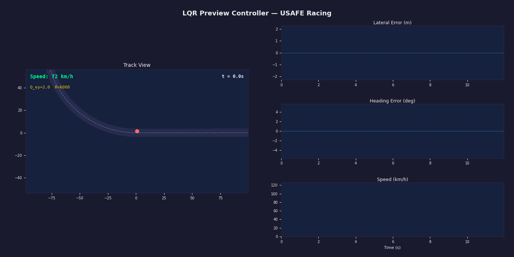
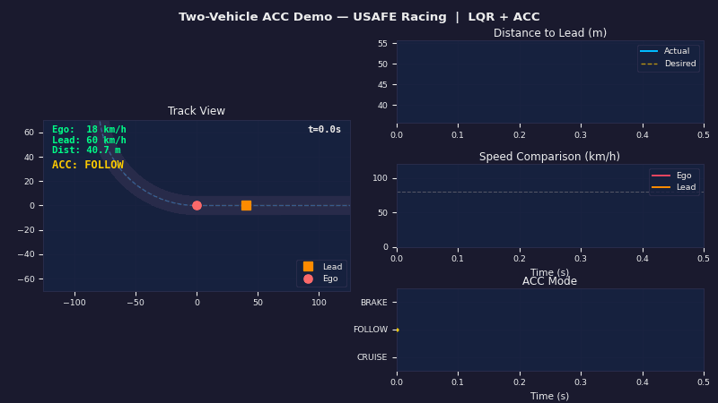

# LQR Racing Controller

Speed-scheduled LQR preview controller for autonomous racing, based on a bicycle vehicle model.

Ported from the C++ ROS controller used by HMCL-UNIST (USAFE Racing Team) at KIAPI 2024.

## 1. LQR Lateral Controller



- **LQR preview controller** with delay compensation for lateral steering
- **Delay-augmented state** (5 + delay_step = 10 dimensions)
- **Curvature preview feedforward** (50-step lookahead)
- **PID speed controller** with gain scheduling for longitudinal velocity tracking
- Speed-scheduled Q/R weights (20~110+ km/h)

```bash
pip install numpy matplotlib scipy
python3 lqr_controller.py
```

| Key | Action |
|-----|--------|
| Space | Pause / Resume |
| Up/Down | Adjust target speed +/-10 km/h |
| R | Reset simulation |
| Q / Esc | Quit |

## 2. Two-Vehicle Adaptive Cruise Control (ACC)



LQR-based Adaptive Cruise Control with two vehicles on an oval racing track.

- **Lead vehicle** (orange): Variable speed - slows in curves, periodic speed changes, braking events
- **Ego vehicle** (red): LQR lateral control + LQR-based ACC longitudinal control
- **ACC Modes**: CRUISE (green) / FOLLOW (yellow) / BRAKE (red)
- Emergency braking with hard speed limiting for collision avoidance
- Time-gap based following distance (1.0s gap + 8.0m minimum)

```bash
python3 two_vehicle_acc_demo.py
```

| Key | Action |
|-----|--------|
| Space | Pause / Resume |
| Up/Down | Adjust ego cruise speed +/-10 km/h |
| L/K | Adjust lead vehicle speed +/-5 km/h |
| R | Reset simulation |
| Q / Esc | Quit |

### ACC Control Law

LQR-based optimal speed controller that maintains a safe following distance to the lead vehicle.

### ACC Vehicle Model

3-state longitudinal model with actuator lag:

**State vector:**

$$\mathbf{x} = \begin{bmatrix} e_d \\ e_v \\ a \end{bmatrix}$$

| State | Description |
|---|---|
| $e_d$ | Distance error: $d_{\text{desired}} - d_{\text{actual}}$ |
| $e_v$ | Velocity error (relative speed) |
| $a$ | Current longitudinal acceleration |

**Desired following distance:**

$$d_{\text{desired}} = v_{\text{ego}} \cdot t_{\text{gap}} + d_{\text{min}}$$

where $t_{\text{gap}} = 1.0$ s (time headway) and $d_{\text{min}} = 8.0$ m (minimum gap).

### ACC Continuous System Matrices

**Dynamics matrix** $A_c$:

$$A_c = \begin{bmatrix} 0 & 0 & t_{\text{gap}} \\ 0 & -1 & 1 \\ 0 & 0 & -1/\tau \end{bmatrix}$$

**Input matrix** $B_c$:

$$B_c = \begin{bmatrix} 0 \\ 0 \\ 1/\tau \end{bmatrix}$$

where $\tau = 0.6$ s is the longitudinal actuator time constant.

**Physical interpretation:**

| Row | Equation | Meaning |
|---|---|---|
| $\dot{e}_d$ | $= t_{\text{gap}} \cdot a$ | Distance error changes with time-gap × acceleration |
| $\dot{e}_v$ | $= -e_v + a$ | Velocity error with damping + acceleration coupling |
| $\dot{a}$ | $= -a/\tau + u/\tau$ | First-order actuator lag on acceleration |

### ACC Discretization (Bilinear / Tustin)

Same method as the lateral controller:

$$A_d = \left(I - \frac{\Delta t}{2} A_c\right)^{-1} \left(I + \frac{\Delta t}{2} A_c\right)$$

$$B_d = \left(I - \frac{\Delta t}{2} A_c\right)^{-1} \Delta t \cdot B_c$$

where $\Delta t = 0.04$ s (25 Hz).

### ACC DARE and Control Law

**Cost function:**

$$J = \sum_{k=0}^{\infty} \left( \mathbf{x}_k^T Q \mathbf{x}_k + u_k^T R \, u_k \right)$$

**Weight matrices:**

$$Q = \begin{bmatrix} Q_d & 0 & 0 \\ 0 & Q_v & 0 \\ 0 & 0 & 0 \end{bmatrix}, \quad R = [R_w]$$

| Parameter | Symbol | Value |
|---|---|---|
| Distance error weight | $Q_d$ | 50.0 |
| Velocity error weight | $Q_v$ | 20.0 |
| Control effort weight | $R_w$ | 1.0 |

**DARE iteration** (same as lateral):

$$P_{k+1} = A_d^T P_k A_d - A_d^T P_k B_d \left(R + B_d^T P_k B_d\right)^{-1} B_d^T P_k A_d + Q$$

**Optimal gain:**

$$K = \left(R + B_d^T P B_d\right)^{-1} B_d^T P A_d$$

**Control law:**

$$u = -K \cdot \mathbf{x}_k \quad \text{(acceleration command, m/s²)}$$

**Velocity integration:**

$$v_{\text{cmd}} = v_{\text{current}} + u \cdot \Delta t$$

### ACC Safety Architecture

Three-layer override on top of LQR:

| Layer | Condition | Action |
|---|---|---|
| **LQR ACC** | $d > 0.8 \cdot d_{\text{desired}}$ | Optimal LQR control with lag model |
| **Proportional brake** | $d < 0.8 \cdot d_{\text{desired}}$ | Bypass LQR lag, direct proportional deceleration |
| **Emergency brake** | $d < 1.5 \cdot d_{\text{min}}$ | Full deceleration ($-7.0$ m/s²) + hard speed cap to $0.9 \cdot v_{\text{lead}}$ |

The safety layers exist because the LQR's actuator lag model ($\tau = 0.6$ s) causes slow response to sudden braking events. The proportional and emergency layers bypass this lag for collision avoidance.

---

## 1. PID Controller (Longitudinal Speed Control)

### Overview

Classic PID controller that tracks the target velocity (setpoint) by computing acceleration/deceleration commands from the error between target and current wheel speed.

### I/O

```
Input:  setpoint (target speed, m/s)
        plant_state (current wheel speed, m/s)
Output: control_effort (acceleration command, m/s²)
```

### Gain Scheduling

| Speed Range | Kp | Ki | Kd |
|---|---|---|---|
| $\leq$ 22 km/h (~6.1 m/s) | 0.5 | 0.001 | 0.1 |
| 22~120 km/h | 1.0 | 0.001 | 0.1 |

Lower gains at low speed to prevent abrupt acceleration.

### Error Computation

$$e(t) = v_{\text{target}} - v_{\text{current}}$$

$$u(t) = K_p \cdot e(t) + K_i \int_0^t e(\tau)\,d\tau + K_d \frac{de}{dt}$$

- **Integral**: Anti-windup with saturation limits
- **Derivative**: 2nd-order Butterworth low-pass filter to reject noise
- **Output**: Clamped to `[lower_limit, upper_limit]`

### Safety

- Setpoint clamped to 2~150 km/h range
- Values > 160 or < 0 treated as invalid (reset to 0)
- MissionComplete state forces `control_effort = -2.0` (stop)

---

## 2. Preview Controller (Lateral Steering Control)

### Overview

LQR-based preview controller with delay compensation for lateral path tracking. Uses future curvature information (preview) and models actuator delay explicitly in the state.

### Vehicle Model (Bicycle Model)

4-state linear lateral dynamics model:

**State vector:**

$$\mathbf{x} = \begin{bmatrix} e_y \\ \dot{e}_y \\ e_\psi \\ \dot{e}_\psi \end{bmatrix}$$

| State | Description |
|---|---|
| $e_y$ | Lateral position error (distance to path) |
| $\dot{e}_y$ | Lateral error rate |
| $e_\psi$ | Heading error (vehicle yaw - path yaw) |
| $\dot{e}_\psi$ | Heading error rate |

**Vehicle parameters:**

| Parameter | Symbol | Value |
|---|---|---|
| Wheelbase | $L$ | 2.72 m |
| Front axle to CG | $l_f$ | 1.58 m |
| Rear axle to CG | $l_r$ | 1.59 m |
| Mass | $m$ | 1700 kg |
| Moment of inertia | $I_z = l_f \cdot l_r \cdot m$ | 4287.48 kg·m² |
| Front cornering stiffness | $C_f$ | Tire load based |
| Rear cornering stiffness | $C_r$ | Tire load based |

**Intermediate coefficients:**

$$\sigma_1 = 2(C_f + C_r)$$

$$\sigma_2 = -2(l_f C_f - l_r C_r)$$

$$\sigma_3 = -2(l_f^2 C_f + l_r^2 C_r)$$

### Continuous System Matrices

**Dynamics matrix** $\bar{A}$:

$$\bar{A} = \begin{bmatrix} 0 & 1 & 0 & 0 \\ 0 & -\frac{\sigma_1}{mv} & \frac{\sigma_1}{m} & \frac{\sigma_2}{mv} \\ 0 & 0 & 0 & 1 \\ 0 & \frac{\sigma_2}{I_z v} & -\frac{\sigma_2}{I_z} & \frac{\sigma_3}{I_z v} \end{bmatrix}$$

**Input matrix** $\bar{B}$ (steering):

$$\bar{B} = \begin{bmatrix} 0 \\ \frac{2C_f}{m} \\ 0 \\ \frac{2l_f C_f}{I_z} \end{bmatrix}$$

**Disturbance matrix** $\bar{D}$ (curvature coupling):

$$\bar{D} = \begin{bmatrix} 0 \\ \frac{\sigma_2}{m} - v^2 \\ 0 \\ \frac{\sigma_3}{I_z} \end{bmatrix}$$

### Actuator Lag Augmentation

Real steering has a first-order lag. Adding $\delta_{\text{actual}}$ as a 5th state:

$$\mathbf{x}_{\text{aug}} = \begin{bmatrix} e_y \\ \dot{e}_y \\ e_\psi \\ \dot{e}_\psi \\ \delta_{\text{actual}} \end{bmatrix}$$

$$A_c = \begin{bmatrix} \bar{A}_{4\times4} & \bar{B}_{4\times1} \\ \mathbf{0}_{1\times4} & -\frac{1}{\tau} \end{bmatrix}, \quad B_c = \begin{bmatrix} \mathbf{0}_{4\times1} \\ \frac{1}{\tau} \end{bmatrix}, \quad D_c = \begin{bmatrix} \bar{D}_{4\times1} \\ 0 \end{bmatrix}$$

where $\tau = 0.20$ s is the actuator time constant.

### Delay Buffer Augmentation

Pure input delay of `delay_step = 5` steps (0.20 s) is modeled by augmenting the state with past commands:

$$\mathbf{x}_{\text{full}} = \begin{bmatrix} e_y \\ \dot{e}_y \\ e_\psi \\ \dot{e}_\psi \\ \delta_{\text{actual}} \\ \delta_{k-1} \\ \delta_{k-2} \\ \vdots \\ \delta_{k-n} \end{bmatrix} \in \mathbb{R}^{10}$$

**Extended system** ( n = 5 + delay_step = 10 ):

$$\mathcal{A}_d = \begin{bmatrix} A_d & B_d & & \\ & & I_{n-1} & \\ & & & 0 \end{bmatrix}_{10\times10}, \quad \mathcal{B}_d = \begin{bmatrix} 0 \\ \vdots \\ 0 \\ 1 \end{bmatrix}_{10\times1}$$

New command enters at the end of the buffer, shifts through the delay chain, and reaches the dynamics after `delay_step` timesteps.

### Bilinear (Tustin) Discretization

$$A_d = \left(I - \frac{\Delta t}{2} A_c\right)^{-1} \left(I + \frac{\Delta t}{2} A_c\right)$$

$$B_d = \left(I - \frac{\Delta t}{2} A_c\right)^{-1} \Delta t \cdot B_c$$

$$D_d = \left(I - \frac{\Delta t}{2} A_c\right)^{-1} \Delta t \cdot D_c$$

where $\Delta t = 0.04$ s (20 Hz).

### DARE (Discrete Algebraic Riccati Equation)

Minimizes the infinite-horizon cost:

$$J = \sum_{k=0}^{\infty} \left( \mathbf{x}_k^T Q \mathbf{x}_k + u_k^T R \, u_k \right)$$

Solved by iteration until convergence ($|P_{k+1} - P_k|_{\max} < 10^{-5}$):

$$P_{k+1} = \mathcal{A}_d^T P_k \mathcal{A}_d - \mathcal{A}_d^T P_k \mathcal{B}_d \left(R + \mathcal{B}_d^T P_k \mathcal{B}_d\right)^{-1} \mathcal{B}_d^T P_k \mathcal{A}_d + Q$$

### Control Law

The total steering command is the sum of **state feedback** and **preview feedforward**:

$$\delta = \delta_{\text{state}} + \delta_{\text{preview}}$$

#### State Feedback

$$K_b = \left(R + \mathcal{B}_d^T P \mathcal{B}_d\right)^{-1} \mathcal{B}_d^T P \mathcal{A}_d$$

$$\delta_{\text{state}} = -K_b \cdot \mathbf{x}_k$$

Corrects current lateral and heading errors, including delayed commands in the buffer.

#### Preview Feedforward

Looks ahead at future curvature $\kappa(i)$ along the planned path:

$$K_{f,0} = \left(R + \mathcal{B}_d^T P \mathcal{B}_d\right)^{-1} \mathcal{B}_d^T P \mathcal{D}_d$$

$$\zeta = \mathcal{A}_d^T \left(I + P \mathcal{B}_d R^{-1} \mathcal{B}_d^T\right)^{-1}$$

$$K_{f,i} = \left(R + \mathcal{B}_d^T P \mathcal{B}_d\right)^{-1} \mathcal{B}_d^T \zeta^i P \mathcal{D}_d$$

$$\delta_{\text{preview}} = -\sum_{i=0}^{N_{\text{preview}}} K_{f,i} \cdot \kappa(i)$$

where $N_{\text{preview}} = 50$ steps (~2 seconds lookahead). This enables **proactive steering** before entering a curve.

### Steering Rate Limit

$$|\dot{\delta}| \leq 0.5 \text{ rad/s}$$

$$\delta_{\text{cmd}} = \delta_{\text{prev}} + \text{clip}\!\left(\frac{\delta_{\text{cmd}} - \delta_{\text{prev}}}{\Delta t},\; -0.5,\; 0.5\right) \cdot \Delta t$$

### Speed-Scheduled Q/R Weights

| Speed (km/h) | $Q_{e_y}$ | $Q_{\dot{e}_y}$ | $Q_{e_\psi}$ | $Q_{\dot{e}_\psi}$ | $R$ | Strategy |
|---|---|---|---|---|---|---|
| > 108 | 0.8 | 1.0 | 1.3 | 0.8 | **7800** | Stability first |
| > 100 | 1.0 | 1.0 | 1.5 | 1.0 | **7500** | Smooth steering |
| > 85 | 1.0 | 1.5 | 2.5 | 2.5 | **7500** | Heading tracking |
| > 78 | 4.2 | 2.0 | 3.0 | 3.0 | **7000** | Corner entry |
| > 55 | 2.0 | 1.0 | 6.0 | 1.0 | **6000** | Precision heading |
| > 30 | 4.0 | 3.0 | 7.0 | 1.0 | **4500** | Aggressive tracking |
| > 20 | 3.0 | 5.0 | 7.0 | 1.0 | **2500** | Very aggressive |
| $\leq$ 20 | 5.0 | 5.0 | 10.0 | 1.0 | **2000** | Maximum tracking |

- **High speed**: Large $R$ suppresses steering input for stability
- **Low speed**: Large $Q$ prioritizes tight path following

---

## System Architecture

```
 ┌──────────────────────────────────────────────────────────────┐
 │                    LONGITUDINAL (Speed)                      │
 │                                                              │
 │  Curvature ──→ Target Speed ──→ PID Controller ──→ Accel    │
 │                  (60/110 kmh)    (gain scheduled)    cmd     │
 │                       ↑                                      │
 │                  [Up/Down key]                                │
 └──────────────────────────┬───────────────────────────────────┘
                            │ current speed
 ┌──────────────────────────▼───────────────────────────────────┐
 │                     LATERAL (Steering)                        │
 │                                                              │
 │  ┌─────────┐   ┌──────────┐   ┌──────────┐   ┌───────────┐ │
 │  │ Nearest │──→│ Compute  │──→│ Schedule │──→│ Build     │ │
 │  │ Point   │   │ ey, epsi │   │ Q/R      │   │ Ad,Bd,Dd  │ │
 │  └─────────┘   └──────────┘   └──────────┘   │ (10x10)   │ │
 │                                                └─────┬─────┘ │
 │                                                      ▼       │
 │  ┌─────────────────────────────────────────────────────────┐ │
 │  │                    Solve DARE                           │ │
 │  │         P = Ad'PAd - Ad'PBd(R+Bd'PBd)⁻¹Bd'PAd + Q     │ │
 │  └────────────────────────┬────────────────────────────────┘ │
 │                           ▼                                  │
 │  ┌────────────────┐  ┌────────────────────────┐              │
 │  │ State Feedback │  │ Preview Feedforward    │              │
 │  │ δ_s = -Kb · Xk │  │ δ_p = -Σ Kf_i · κ(i) │              │
 │  └───────┬────────┘  └───────────┬────────────┘              │
 │          └──────────┬────────────┘                            │
 │                     ▼                                        │
 │           δ = δ_state + δ_preview                            │
 │                     │                                        │
 │            Rate limit + Actuator lag                         │
 │                     │                                        │
 │                     ▼                                        │
 │              Bicycle Model Update                            │
 │              x, y, yaw ← f(vx, δ)                           │
 └──────────────────────────────────────────────────────────────┘
```

## Comparison

| | PID (Longitudinal) | Preview LQR (Lateral) |
|---|---|---|
| **Purpose** | Target speed tracking | Path following (steering) |
| **Theory** | PID + Gain Scheduling | LQR + Preview + Delay Compensation |
| **Rate** | 20 Hz | 20 Hz |
| **States** | 1 (speed error) | 10 (4 dynamics + 1 lag + 5 delay) |
| **Key Feature** | Butterworth derivative filter | Riccati equation, curvature feedforward |
| **Output** | Acceleration (m/s²) | Steering angle (rad) |
